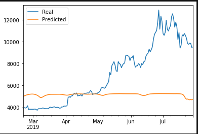
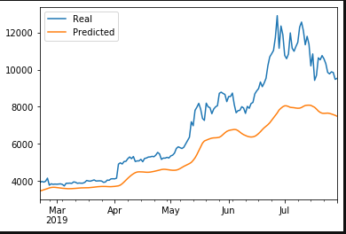
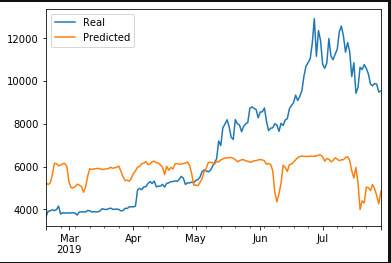
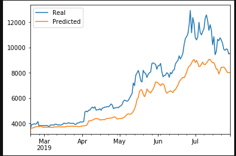

# DeepLearning on LSTM Stock Prediction

We have used rolling window time series of ***Fear and Greed Index (FNG)*** and the ***Closing Price*** with the Deep Learning Recurrent Nural Networks (RNN) to predict closing price of BitCoin (BTC) to predic closing price.

## Outline
Analysis, model fit, and forcast of BTC Closing using tunable windows and LSTM (Long Short Term Memory) RNN.

## Part 1. Variable Window FNG of BitCoin to predict Closing Price of BitCoin

We have used provided .csv files to extract both the FNG and the Closing Prices of BTC in given time period to buid a data frame. From the data frame following shaping data to a variable time window form (via custom function ***window_data***) and then they underwent a 70% (Train) to 30% (Test) split to further process the data. Then these were reshaped towards a LSTM RNN model with a variable droput fraction. Model fit had 15 epochs. Model was evaluated in two different window lengths and changing epochs (settling in 15 epochs).
Evaluation metrics were obtaind as loss and a graphical output of Real vs. Predicted graph for the test data. 

## Part 2. Variable Window Closing Price of BitCoin to predict Closing Price of BitCoin

We have used provided .csv files to extract the Closing Prices of BTC in given time period to buid a data frame. From the data frame following shaping data to a variable time window form (via custom function ***window_data***) and then they underwent a 70% (Train) to 30% (Test) split to further process the data. Then these were reshaped towards a LSTM RNN model with a variable droput fraction. Model fit had 15 epochs. Model was evaluated in two different window lengths and changing epochs (settling in 15 epochs).
Evaluation metrics were obtaind as loss and a graphical output of Real vs. Predicted graph for the test data. 

## Model Comparison 

### Which model has a lower loss?

Lowest Loss is with the Closing Prices (of a given time window) to predict the BTC Closing price. That is Closing Prices were a better predictor than the FNG for the Closing Price of the BTC. See the tables below and the graphs below.

*Table 1: 15 Epochs - Closing Price to Predict BTC Closing*
| Window Length | Loss-Evaluation | Predictive shape following Test data |
| ----------- | ----------- | ----------- |
| 10 | 0.0394 | Generall shape with significant lagging |
| 3 | 0.0259 | Best shape but still lagging the Closing Price |

*Table 2: 15 Epochs - FNG to Predict BTC Closing*
| Window Length | Loss-Evaluation | Predictive shape following Test data |
| ----------- | ----------- | ----------- |
| 10 | 0.1160 | Worst shape with least Predictability in coparision to Closing Price |
| 3 | 0.0898 | Best shape of the very bad coparision to Closing Price |

### Which model tracks the actual values better over time?

Clearly better predictions were from the the Closing Prices (of a given time window) to predict the BTC Closing price. As mentioned above the Closing Prices were a better predictor than the FNG for the Closing Price of the BTC. See the tables above and the graphs below.

### Which window size works best for the model?

For both models (FNG vs. Closing Prices to predict BTC future Closing Price) shorter the window better the predictability. We have compared Window length of 3 vs. a window length of 10 and clearly the window length of 3 gives better predictability. See the tables above and the graphs below.

### Comparison of Models at a Window Length = 10

FNG (of BTC) as a predictor of Closing Price

Closing Price (of BTC) as a predictor of Closing Price

### Comparison of Models at a Window Length = 3

FNG (of BTC) as a predictor of Closing Price

Closing Price (of BTC) as a predictor of Closing Price

### Technologies implemented
Python, Scikit-Learn, Pandas, TensorFlow/Keras, and PyPlot.

### Techniques Implemented
Deep Learning, Recurrent Neural Networks with LSTM, Dense and droput fraction.

### Inputs
btc_historic.csv and btc_sentiment.csv files to import data.

### Outputs
Outputs are presented as plots and and numerical metrics to evaluate the models.

### Remarks
FNG as predictor for the BTC Closing Price in a gross sense is very poor. However some fluctuation both up/down can be seen in the predictive y values.
Closing Price of BTC is comparatively better specially at short windows but still lags the Closing Price and may need a correction factor applied if we were to consider it as predictor. 
Remarks
None.
